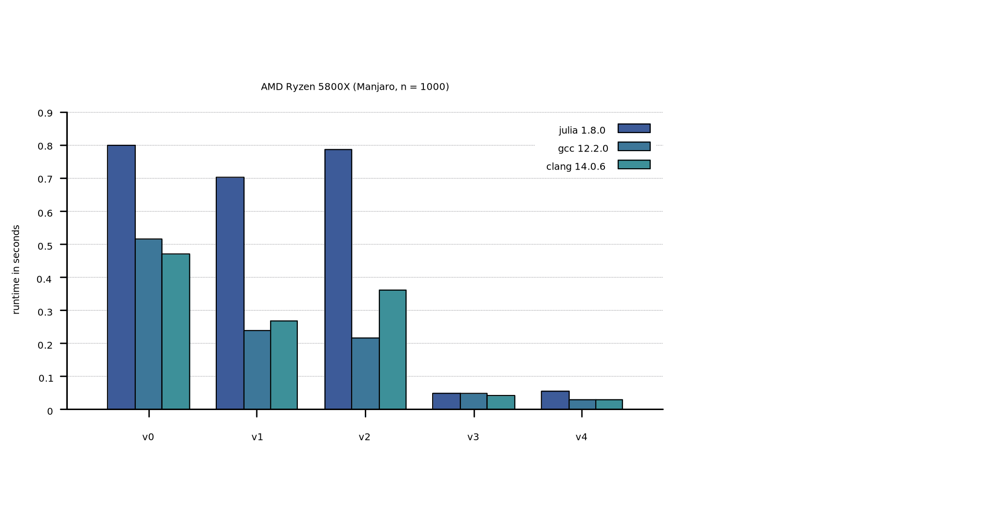
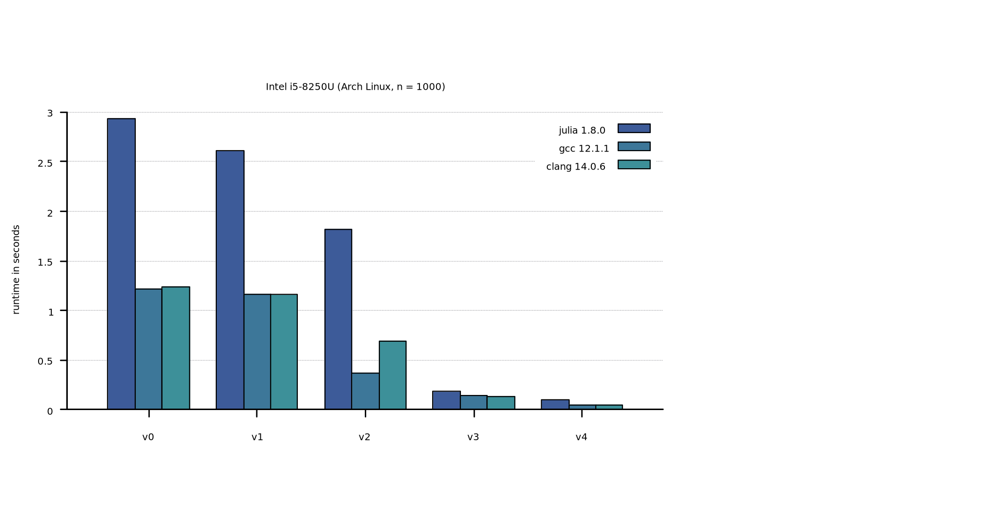

# Programming Parallel Computers Case Study in Julia

This Repository aims to develop julia equivalents to the c++ code samples provided
in [this online course](https://ppc.cs.aalto.fi/ch2/) on parallel programming by
the Aalto University in Espoo, Finland.

The code used in the case study is short, simple, and showcases techniques for
optimization on modern x86 CPUs. Therefore, it is a good project to understand
certain performance characteristics of Julia (like the usage of SIMD
instructions).

## Problem

The shortcut problem is described [here](https://ppc.cs.aalto.fi/ch2/).

## Implementations

We consider several implementations that are meant to exploit increasingly
sophisticated optimization methods (like SIMD or proper L1-cache reusage).
Put in simple terms, the following version are compared:

**v0.** Naive and straightforward implementation via simple loops.

**v1.** Create a transposed copy of the input so that consecutive memory regions
can be used for both summands.

**v2.** Break the sequential dependency in the inner loop by breaking it in
several independent parts.

**v3.** Exploit AVX instructions to compute 8 Float32 additions and mins in
parallel.

**v4.** Improve L1-cache data reuse by changing the order of looping.

The [lecture notes](https://ppc.cs.aalto.fi/ch2/) provide more optimizations (up
to v7), but this repository currently only explores v1 to v4. The corresponding
julia implementations can be found in the file `ppc.jl`, designated as
`vx_julia`. The C++ implementations, copied from
[here](https://ppc.cs.aalto.fi/ch2/), are in `ppc.cpp`. The simple makefile
compiles this file with both `g++` and `clang` to shared libraries `ppc-gcc` and
`ppc-clang`, which are then wrapped in julia (`vx_{gcc,clang}`) for common
benchmarking.

## Results

To run the full benchmark (with `n = 1000`), first compile the gcc and clang
shared libraries via `make` and then execute `julia benchmark.jl`.
This requires the package `BenchmarkTools`. Besides
printing information, this will also create the file `times.dat`, which
can be visualized via the included gnuplot script `plot.gp`

Below are example timings for the desktop CPU AMD Ryzen 7 5800X CPU and laptop CPU
Intel Core i5-8250U. In both cases, the official julia 1.8.0 binaries were used.

